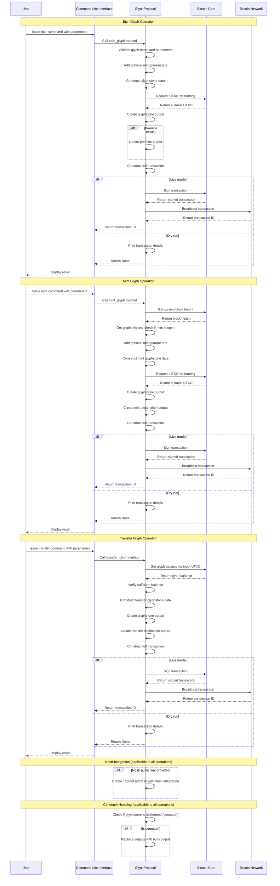

# PythonGlyphs
based on Melvin Carvalho glyphs and Runes protocols

```mermaid
sequenceDiagram
    participant User
    participant CLI as Command Line Interface
    participant GP as GlyphProtocol
    participant BC as Bitcoin Core
    participant BN as Bitcoin Network

    Note over User,BN: Etch Glyph Operation
    User->>CLI: Issue etch command with parameters
    CLI->>GP: Call etch_glyph method
    GP->>GP: Validate glyph name and parameters
    GP->>GP: Add optional mint parameters
    GP->>GP: Construct glyphstone data
    GP->>BC: Request UTXO for funding
    BC-->>GP: Return suitable UTXO
    GP->>GP: Create glyphstone output
    alt Premine exists
        GP->>GP: Create premine output
    end
    GP->>GP: Construct full transaction
    alt Live mode
        GP->>BC: Sign transaction
        BC-->>GP: Return signed transaction
        GP->>BN: Broadcast transaction
        BN-->>GP: Return transaction ID
        GP-->>CLI: Return transaction ID
    else Dry run
        GP->>GP: Print transaction details
        GP-->>CLI: Return None
    end
    CLI-->>User: Display result

    Note over User,BN: Mint Glyph Operation
    User->>CLI: Issue mint command with parameters
    CLI->>GP: Call mint_glyph method
    GP->>BC: Get current block height
    BC-->>GP: Return block height
    GP->>GP: Get glyph info and check if mint is open
    GP->>GP: Add optional mint parameters
    GP->>GP: Construct mint glyphstone data
    GP->>BC: Request UTXO for funding
    BC-->>GP: Return suitable UTXO
    GP->>GP: Create glyphstone output
    GP->>GP: Create mint destination output
    GP->>GP: Construct full transaction
    alt Live mode
        GP->>BC: Sign transaction
        BC-->>GP: Return signed transaction
        GP->>BN: Broadcast transaction
        BN-->>GP: Return transaction ID
        GP-->>CLI: Return transaction ID
    else Dry run
        GP->>GP: Print transaction details
        GP-->>CLI: Return None
    end
    CLI-->>User: Display result

    Note over User,BN: Transfer Glyph Operation
    User->>CLI: Issue transfer command with parameters
    CLI->>GP: Call transfer_glyph method
    GP->>BC: Get glyph balance for input UTXO
    BC-->>GP: Return glyph balance
    GP->>GP: Verify sufficient balance
    GP->>GP: Construct transfer glyphstone data
    GP->>GP: Create glyphstone output
    GP->>GP: Create transfer destination output
    GP->>GP: Construct full transaction
    alt Live mode
        GP->>BC: Sign transaction
        BC-->>GP: Return signed transaction
        GP->>BN: Broadcast transaction
        BN-->>GP: Return transaction ID
        GP-->>CLI: Return transaction ID
    else Dry run
        GP->>GP: Print transaction details
        GP-->>CLI: Return None
    end
    CLI-->>User: Display result

    Note over User,BN: Nostr Integration (applicable to all operations)
    alt Nostr public key provided
        GP->>GP: Create Taproot address with Nostr integration
    end

    Note over User,BN: Cenotaph Handling (applicable to all operations)
    GP->>GP: Check if glyphstone is malformed (cenotaph)
    alt Is cenotaph
        GP->>GP: Replace outputs with burn output
    end

```

