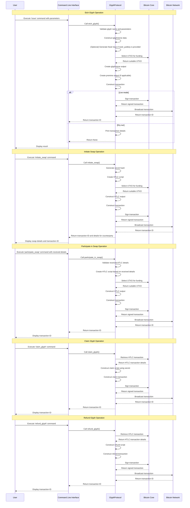

# Rusty Glyphs

..based on [Glyphs](https://github.com/glyph-protocol/glyphs
) and the preceding [Runes](https://docs.ordinals.com/runes/specification.html
) protocols


To execute the provided Rust code with a Testnet wallet, you'll need to set up your environment and follow these steps:

### 1. **Set Up Your Rust Environment**
   - Ensure that you have Rust installed. If not, install it using `rustup`:

     ```sh
     curl --proto '=https' --tlsv1.2 -sSf https://sh.rust-lang.org | sh
     ```

   - Install the required dependencies specified in your `Cargo.toml` file. If you don't have a `Cargo.toml`, you'll need to create one and include the necessary dependencies, such as `bitcoincore_rpc`, `bitcoin`, `secp256k1`, `clap`, `thiserror`, and `bech32`.

### 2. **Create a Testnet Wallet**
   - Set up a Bitcoin Core node on Testnet. You can download and install Bitcoin Core from [bitcoin.org](https://bitcoin.org/en/download).
   - Configure your `bitcoin.conf` file for Testnet. The configuration file should include the following:

     ```ini
     testnet=1
     server=1
     rpcuser=your_rpc_username
     rpcpassword=your_rpc_password
     ```

   - Start your Bitcoin Core node and create a new wallet using the Bitcoin CLI:

     ```sh
     bitcoin-cli -testnet createwallet "testnet_wallet"
     ```

### 3. **Prepare the Rust Project**
   - Create a new Rust project:

     ```sh
     cargo new glyph_protocol
     cd glyph_protocol
     ```

   - Add the necessary dependencies to your `Cargo.toml`:

     ```toml
     [dependencies]
     bitcoin = "0.26"
     secp256k1 = "0.22"
     bitcoincore_rpc = "0.18"
     clap = "3.0.0"
     thiserror = "1.0"
     unicode-categories = "0.1"
     bech32 = "0.8"
     ```

   - Replace the contents of `src/main.rs` with the full script provided earlier.

### 4. **Configure the Testnet Connection**
   - Update the RPC connection details in the code to match your Testnet node configuration. For example:

     ```rust
     let glyph_protocol = GlyphProtocol::new(
         Network::Testnet, 
         "http://127.0.0.1:18332", 
         "your_rpc_username", 
         "your_rpc_password"
     )?;
     ```

### 5. **Compile and Run the Project**
   - Compile the project:

     ```sh
     cargo build
     ```

   - Run the program and interact with it using the CLI. For example, you can issue a Glyph, mint new Glyphs, or perform transfers:

     ```sh
     cargo run -- issue --name "TESTGLYPH" --destination_address "your_testnet_address"
     ```

   - To see all available commands, use:

     ```sh
     cargo run -- --help
     ```

### 6. **Testing and Debugging**
   - If you encounter any issues, you can enable more verbose logging in your Bitcoin Core configuration (`debug=rpc`) and review the logs to see what's happening with the RPC calls.
   - You can also add `println!` statements in your Rust code to debug the flow of your program.

### 7. **Receiving Testnet Coins**
   - You may need Testnet coins (tBTC) to test the transactions. You can obtain them from a Testnet faucet, such as the [Bitcoin Testnet Faucet](https://testnet-faucet.com/btc-testnet/).

### 8. **Executing Commands**
   - Here are some example commands you might run:

     - **Issue a Glyph**:

       ```sh
       cargo run -- issue --name "GLYPH1" --symbol "G" --premine 100 --destination_address "your_testnet_address"
       ```

     - **Mint a Glyph**:

       ```sh
       cargo run -- mint --glyph_id "block:tx" --amount 10 --destination_address "your_testnet_address"
       ```

     - **Transfer a Glyph**:

       ```sh
       cargo run -- transfer --glyph_id "block:tx" --input_txid "your_input_txid" --input_vout 0 --amount 10 --destination_address "recipient_testnet_address"
       ```

### 9. **Implementing Unit Tests**
   - To ensure your implementation is correct, you should create unit tests in the `tests` directory or within the `src/main.rs` file.

This setup should allow you to run and test your Rust implementation of the Glyph Protocol using a Testnet wallet. If you encounter any issues, feel free to ask for further assistance.



# TO DO

### **Architecture Overview**

1. **Frontend (Web Interface)**:
    - **Technologies**: HTML, CSS, JavaScript (React.js or Vue.js for dynamic components), Nostr Integration via Alby Wallet.
    - **Functionality**:
      - User Interface for creating, viewing, and interacting with Glyphs.
      - Wallet management (view balance, create transactions).
      - Nostr login and integration using Alby Wallet.
      - API calls to the backend (Rust server) for blockchain operations.

2. **Backend (Rust-based Glyph Protocol Server)**:
    - **Technologies**: Rust, Rocket or Actix-web for the HTTP server, bitcoincore_rpc for Bitcoin interaction, secp256k1, and other necessary crates.
    - **Functionality**:
      - Serve API endpoints to handle operations like issuing, minting, transferring Glyphs, and managing atomic swaps.
      - Integration with the Bitcoin Testnet through bitcoincore_rpc.
      - Handle blockchain interactions (UTXO selection, transaction signing, broadcasting).
      - Interface with Nostr for key management and encoding/decoding operations.

3. **Bitcoin Testnet Node**:
    - **Setup**: Bitcoin Core running on Testnet with RPC enabled.
    - **Functionality**:
      - Handle actual blockchain operations (UTXO management, transaction broadcasting).
      - Provide RPC services that the Rust backend interacts with.

### **Detailed Design**

#### **1. Frontend (Web Interface)**

- **Alby Wallet Integration**:
  - Use Alby Wallet's Nostr login feature to authenticate users and retrieve their Nostr public keys.
  - Store or pass this Nostr public key to the backend for operations like issuing or transferring Glyphs.

- **Wallet Management**:
  - Display the Testnet wallet balance and transaction history.
  - Allow users to initiate Glyph operations (issue, mint, transfer, swap) through UI forms.
  - Make API requests to the backend when these forms are submitted.

- **User Interface**:
  - **Balance Display**: Show the user’s Testnet balance and related transaction IDs.
  - **Glyphs Management**: Interface to issue, mint, and transfer Glyphs.
  - **Nostr Features**: Display Nostr-related details like npub and nrepo encoded keys.

#### **2. Backend (Rust Server)**

- **API Endpoints**:
  - **`/issue`**: Handles Glyph issuance. Takes parameters like name, divisibility, premine, destination address, etc., from the frontend and returns the transaction ID.
  - **`/mint`**: Endpoint to mint new Glyphs. Accepts parameters like glyph ID, amount, destination address, etc.
  - **`/transfer`**: Endpoint to transfer existing Glyphs.
  - **`/swap/initiate`**: Endpoint to initiate an atomic swap.
  - **`/swap/participate`**: Endpoint to participate in a swap.
  - **`/claim` and `/refund`**: Handle claiming and refunding of HTLCs.

- **Blockchain Interaction**:
  - Use `bitcoincore_rpc` to interact with the Bitcoin Testnet node.
  - Perform operations such as UTXO selection, transaction signing, and broadcasting.

- **Nostr Integration**:
  - Handle encoding/decoding of Nostr keys and potentially manage Nostr-related operations like publishing events (if required).

#### **3. Bitcoin Testnet Node**

- **Testnet Configuration**:
  - Ensure the node is configured to handle RPC requests from the Rust backend.
  - The node must have sufficient Testnet coins to handle operations initiated by users.
  
### **Flow Example: Issuing a Glyph**

1. **User Interaction**:
    - The user logs in using the Alby Wallet (Nostr login).
    - They fill out a form on the web interface to issue a new Glyph.

2. **Frontend to Backend**:
    - The form submission triggers an API call to the Rust backend (`/issue` endpoint).
    - The frontend sends parameters like the Glyph name, symbol, premine amount, etc., to the backend.

3. **Backend Processing**:
    - The Rust backend validates the request, constructs the Glyphstone data, and selects a suitable UTXO using the Testnet node.
    - It creates and signs the transaction, then broadcasts it to the Testnet.
    - The backend sends back the transaction ID to the frontend.

4. **Frontend Response**:
    - The frontend displays the transaction ID to the user, confirming that the Glyph has been issued.

### **Deployment and Testing**

- **Development Environment**:
  - Set up a local Testnet node and run the Rust backend locally.
  - Use the web interface connected to this local setup for development and testing.

- **Production Deployment**:
  - Deploy the Rust backend on a cloud service or dedicated server.
  - Use a Testnet node that is accessible to the backend, either self-hosted or a managed service.
  - Serve the frontend via a standard web server (e.g., Nginx or Apache).

- **Testing**:
  - Conduct end-to-end testing using the Testnet environment to ensure all operations work seamlessly.
  - Implement unit and integration tests within the Rust backend.

This design allows you to integrate the Rust-based Glyph Protocol into a modern web interface with Nostr and Bitcoin Testnet support, leveraging the power of both frontend and backend technologies.
