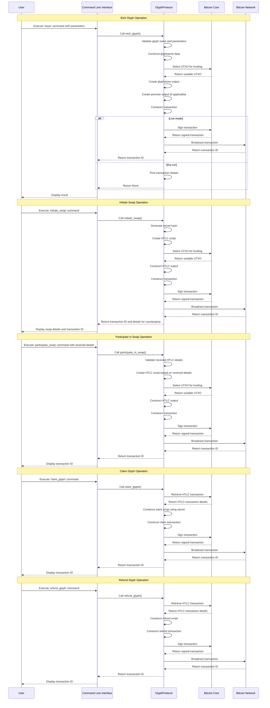

# Rusty Glyphs
based on Melvin Carvalho glyphs and Runes protocols

Areas for Improvement:
Blockchain Querying: Implement the get_glyph_info and get_glyph_balance functions with actual blockchain interaction logic using the bitcoincore_rpc client.
Data Encoding and Decoding: The decode_glyphstone method is implemented, but a corresponding encode_glyphstone function might be useful for constructing Glyphstone data from structured data.
Testing: Implement comprehensive unit tests to ensure the correctness of the core Glyphs logic.

