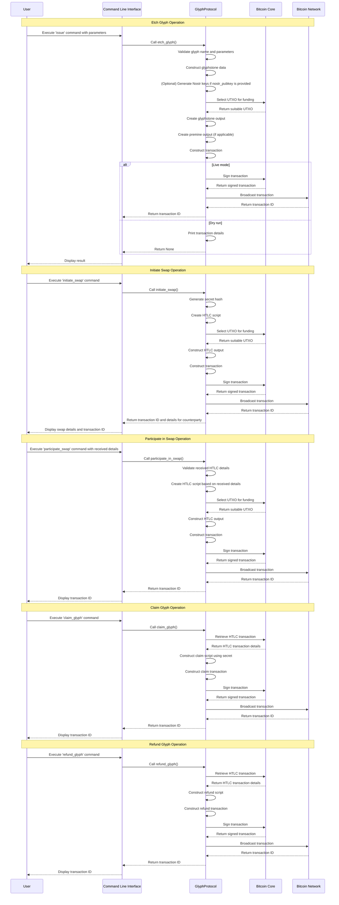

# Rusty Glyphs

..based on Melvin Carvalho glyphs and the preceding Runes protocols

https://github.com/glyph-protocol/glyphs
https://docs.ordinals.com/runes/specification.html

To execute the provided Rust code with a Testnet wallet, you'll need to set up your environment and follow these steps:

### 1. **Set Up Your Rust Environment**
   - Ensure that you have Rust installed. If not, install it using `rustup`:

     ```sh
     curl --proto '=https' --tlsv1.2 -sSf https://sh.rust-lang.org | sh
     ```

   - Install the required dependencies specified in your `Cargo.toml` file. If you don't have a `Cargo.toml`, you'll need to create one and include the necessary dependencies, such as `bitcoincore_rpc`, `bitcoin`, `secp256k1`, `clap`, `thiserror`, and `bech32`.

### 2. **Create a Testnet Wallet**
   - Set up a Bitcoin Core node on Testnet. You can download and install Bitcoin Core from [bitcoin.org](https://bitcoin.org/en/download).
   - Configure your `bitcoin.conf` file for Testnet. The configuration file should include the following:

     ```ini
     testnet=1
     server=1
     rpcuser=your_rpc_username
     rpcpassword=your_rpc_password
     ```

   - Start your Bitcoin Core node and create a new wallet using the Bitcoin CLI:

     ```sh
     bitcoin-cli -testnet createwallet "testnet_wallet"
     ```

### 3. **Prepare the Rust Project**
   - Create a new Rust project:

     ```sh
     cargo new glyph_protocol
     cd glyph_protocol
     ```

   - Add the necessary dependencies to your `Cargo.toml`:

     ```toml
     [dependencies]
     bitcoin = "0.26"
     secp256k1 = "0.22"
     bitcoincore_rpc = "0.18"
     clap = "3.0.0"
     thiserror = "1.0"
     unicode-categories = "0.1"
     bech32 = "0.8"
     ```

   - Replace the contents of `src/main.rs` with the full script provided earlier.

### 4. **Configure the Testnet Connection**
   - Update the RPC connection details in the code to match your Testnet node configuration. For example:

     ```rust
     let glyph_protocol = GlyphProtocol::new(
         Network::Testnet, 
         "http://127.0.0.1:18332", 
         "your_rpc_username", 
         "your_rpc_password"
     )?;
     ```

### 5. **Compile and Run the Project**
   - Compile the project:

     ```sh
     cargo build
     ```

   - Run the program and interact with it using the CLI. For example, you can issue a Glyph, mint new Glyphs, or perform transfers:

     ```sh
     cargo run -- issue --name "TESTGLYPH" --destination_address "your_testnet_address"
     ```

   - To see all available commands, use:

     ```sh
     cargo run -- --help
     ```

### 6. **Testing and Debugging**
   - If you encounter any issues, you can enable more verbose logging in your Bitcoin Core configuration (`debug=rpc`) and review the logs to see what's happening with the RPC calls.
   - You can also add `println!` statements in your Rust code to debug the flow of your program.

### 7. **Receiving Testnet Coins**
   - You may need Testnet coins (tBTC) to test the transactions. You can obtain them from a Testnet faucet, such as the [Bitcoin Testnet Faucet](https://testnet-faucet.com/btc-testnet/).

### 8. **Executing Commands**
   - Here are some example commands you might run:

     - **Issue a Glyph**:

       ```sh
       cargo run -- issue --name "GLYPH1" --symbol "G" --premine 100 --destination_address "your_testnet_address"
       ```

     - **Mint a Glyph**:

       ```sh
       cargo run -- mint --glyph_id "block:tx" --amount 10 --destination_address "your_testnet_address"
       ```

     - **Transfer a Glyph**:

       ```sh
       cargo run -- transfer --glyph_id "block:tx" --input_txid "your_input_txid" --input_vout 0 --amount 10 --destination_address "recipient_testnet_address"
       ```

### 9. **Implementing Unit Tests**
   - To ensure your implementation is correct, you should create unit tests in the `tests` directory or within the `src/main.rs` file.

This setup should allow you to run and test your Rust implementation of the Glyph Protocol using a Testnet wallet. If you encounter any issues, feel free to ask for further assistance.



